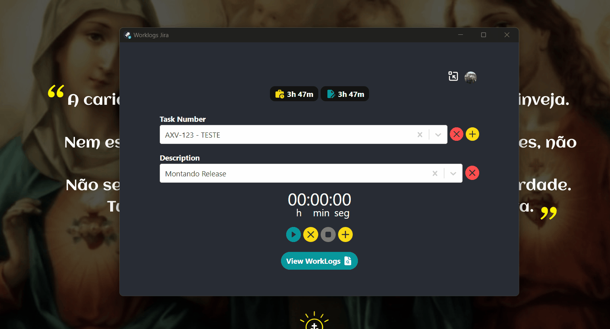
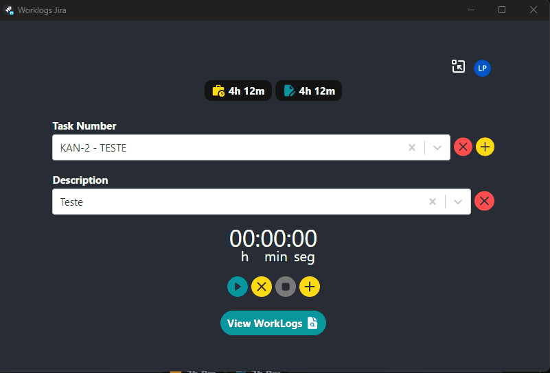
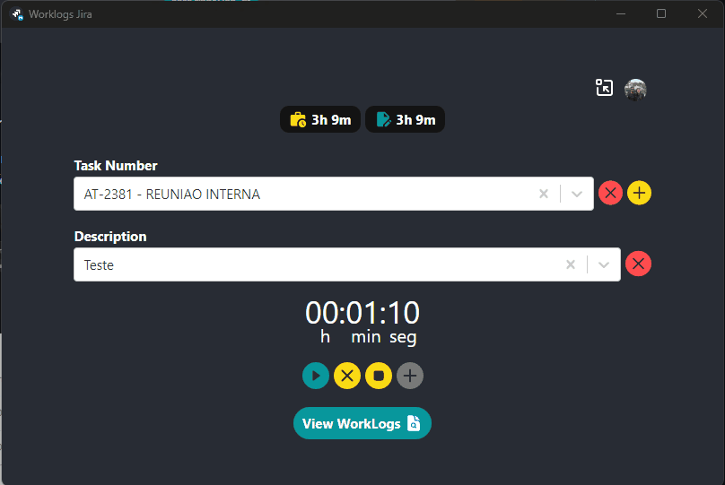
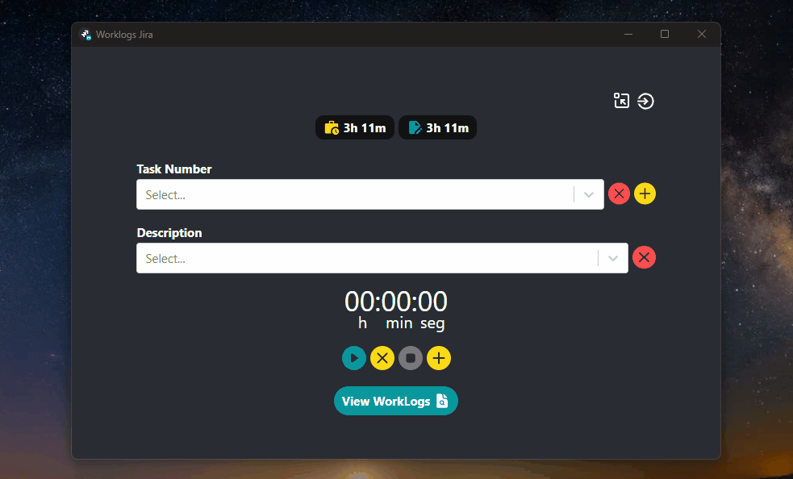
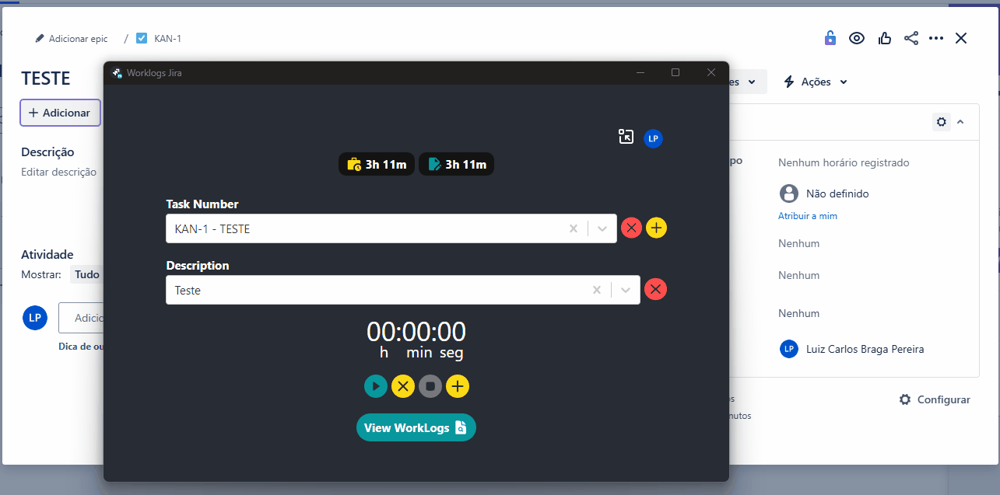
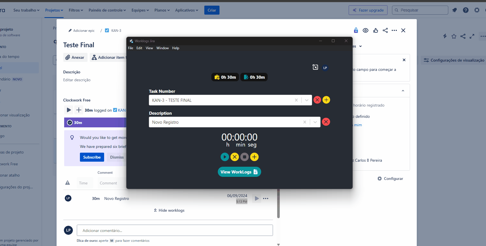

<h1 align="center">
Worklogs Jira
</h1>

Aplicação desenvolvida para auxiliar no crontrole de tempo gasto em cada tarefa do Jira, tendo uma agilidade maior para trabalhar durante o dia para fazer os lançamento apenas no final do dia.

Apoie o nosso projeto! Sua contribuição ajuda a melhorar continuamente o nosso app e a torná-lo ainda mais incrível. Clique no botão abaixo para fazer uma doação.

  

## 📋 Pré-requisitos

Antes de começar, verifique se você atendeu aos seguintes requisitos:
* Você instalou a versão mais recente do `GIT`
* Você instalou a versão mais recente do `Node.js`

## 💻 Baixando e instalando Worklogs Jira

Baixe a versão desejada do aplicativo:
### Windows
- [Worklogs Jira Setup 0.8.1](https://rebrand.ly/wt436d0) `Latest`
- [Outras versões](https://github.com/luizbp/clockwork-jira-electron/releases)

Depois basta descompatar o arquivo `.rar` e executar o arquivo `Worklogs Jira Setup x.x.x.exe`

## 🎬 Como utilizar

### Cadastrar tarefas

Copie o ID da tarefa que você trabalhando no padrão "XXX...-000..." (ex. ABC-123) e adicione no campo `Task number` dessa forma:

 

### Cadastrar descrição

O cadastro de descrição é referente as descrições que ficam no registro de trabalho do Jira. Para cadastrar basta escrever o texto desejado e pressionar "Enter" dessa forma:

 

### Apontamento pelo timer e manual

Há duas possibilidades de lançar tempo gasto, sendo um pelo timer, onde disparamos o timer e quando clicamos em finalizar o apontamento é efetuado conforme o tempo percorrido e de forma manual;

 

### Logar com o Jira e lançar apontamentos automaticamente com o Jira. - *A partir da versão 0.8.0*

Para realizar o login no Jira afim de que seus lançamentos sejam integrados automaticamente no Jira, basta realizar o login:

 

Toda vez que for finalizado um registro de worklog tanto com o timer quanto o manual, o lançamento será integrado automaticamente:

 

Caso a requisição de algum erro, que pode ocorrer por instabilidade no serviço do Jira ou algo do tipo, você tem a possibilidade de tentar sincronizar o lançamento novamente:

 

## 🤝 Colaboradores

Agradecemos às seguintes pessoas que contribuíram para este projeto:

<table>
  <tr>
    <td align="center">
      <a href="https://github.com/luizbp" target="_blank" title="Luiz Carlos B Pereira">
         
      </a>
    </td>
  </tr>
</table>

## 📝 Licença

Esse projeto está sob licença. Veja o arquivo [LICENÇA](LICENSE.md) para mais detalhes.

[⬆ Voltar ao topo](#worklogs-jira) 
